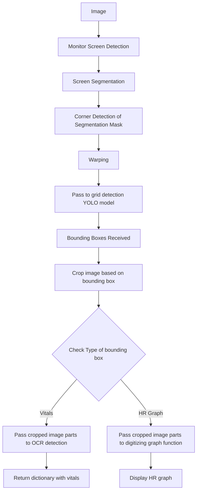
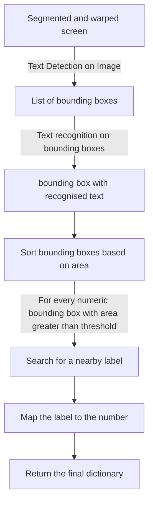

# CloudPhysician

**Team Number: 43**

## Introduction

Extraction of essential information from the CCTV footage of an ICU monitor in an ICU ward is a challenging undertaking. It is not feasible to modify every piece of equipment to transfer data wirelessly due to economical factors. In our situation, we would like to develop a model that inputs the image of an ICU ward and detects the vitals data on the ICU machine. In this study, we provide an overview of the methodology and approaches used to address the issue statement, as well as the models and results obtained. We have also briefly described our attempts to overcome the challenges we faced while solving the PS. 

## Methodology

We have solved our problem by breaking it down into multiple smaller subproblems. Our initial goal is to get a straight and rectified image of the monitor that has all the vitals oriented along the axes, in place of the generally tilted image that we have. This would help in the detection, recognition of the numbers and digitizing of the graph. After that, a method to classify the vitals data given on the screen to different classes, namely, HR, SBP, DBP, SpO2, RR, MAP and HR Graph. Once we have gotten the data correctly classified, we now have to recognize the data and output it followed by digitization of the graph detected. We have also gone ahead and detected whether the ICU monitor has low battery or needs charging, by using the fact that the light on the monitor glows red or yellow when the charge is low. 

## Abstract

We decided to label the different vitals on the monitor along with the placeholder of the vitals such that our DNN model gets trained on the locality rather than the number ranges or colors of the different vitals. We use YOLOv5 for the detection of these localities. This model was developed so that labels can be detected on grayscale and colored images both.



## Task 1: Monitor Segmentation


### 1.1 Bounding Box Segmentation

Before any text detection could take place, it was necessary to first separate the ICU monitor from its surroundings, and manipulate the image into a camera-facing orientation that would be easier for text recognition.

### 1.1.1 Models

It was decided to use YOLO because of its salient features given below.

- **Speed** - With CPU inference, it was critical to carry out segmentation as fast as possible, so as to save as much time as possible further down the pipeline for image processing and text detection. As one of the fastest object detection models, YOLO was the best choice in this regard.
- **General representation** - YOLO has the added advantage of being able to learn general representations of objects, and not just being trained to recognize the class of monitors it was trained on. As a result, YOLO was more likely to correctly identify and segment monitors that might now have been present in the segmentation dataset.
- **Global context** YOLO identifies objects in a global context, by placing them in reference to their surroundings, instead of using techniques like tiling or sliding windows. As a result, other cues like the ICU monitor casing, and background elements of the image would also be utilized in carrying out the detection.

Further, when choosing YOLO, there was the choice of choosing what kind of model to run YOLO on. Both the ONNX and PyTorch implementation of YOLO are known to be fast on CPU, but after testing, surprising results were obtained when the PyTorch model ran faster than ONNX on a dataset of 2000 images. As a result, the PyTorch model was chosen for the segmentation.

### 1.1.2 Segmentation Process

The segmentation pipeline is summarized below, with further details given as subsections

1. **Image import** - The specified images are read from the specified directory in BGR format
2. **Screen segmentation** - The YOLO model is initialized and runs on the images, outputting a set of points denoting the vertices of the segmented mask, represented as a polygon
3. **Identification of monitor corners** - The predicted set of vertices contains a large number of points in order to produce an accurate segmentation of the monitor. However, in order to produce an accurate warping of the screen, we need to identify the 'corners' of the monitor.

### 1.1.2.1 Image import

The image is imported from the specified directory in BGR format using openCV.

### 1.1.2.2 Screen segmentation

The YOLO model predicts a bounding box for the screen and writes them into a file. The file is then read and the vertices are obtained.

### 1.1.2.3 Corner detection

Since the bounding box contains more points than required, it is necessary to find the edges of the mask. This is achieved using a sequence of steps

1. **Binarization** - The mask is plotted using the given images, passed through a bilateral filter, and thresholded to create a binary image.
2. **Contour detection** - Another set of points on the processed mask is obtained using contour detection, and the contours are used in the next step.
3. **Generation of quadrilateral bounding box** - We use the `cv2.approxPolyDP` function on the obtained contour to obtain a bounding box for the contour. Since the segmented mask is roughly quadrilateral shaped, using a tight bound on the maximum perimeter error between the generated polygon and the original mask will ensure that the best fit is obtained by the quadrilateral with corners corresponding to the corners of the monitor screen. As a result we obtain the required corners for the screen to facilitate the warping process.


### 1.2 Warping

After getting the mask of the ICU monitor, we needed to get a cropped, straight and rectified image of the same. Using the bounding box coordinates we have gotten after segmentation we warped the image.

The warping function takes in the input of the corners of the monitor screen and changes the spatial layout of the image to give a straight and rectified image of the monitor.

Warping goes through 2 OpenCV methods to give us the output image.

1. **getPerspectiveTransform()**
    - This method takes in coordinates of the corners of the ROI and calculates the Transormation Matrix needed for the warp.
    
    
    
2. **warpPerspective()**
    - After the transformation matrix is calculated we apply it to the entire image to get the final output image.
    
    
    

### 1.3 Red light detection

After observation of the datasets provided, it became clear that the lights on the ICU monitor blink red only in emergencies of any kind, such as low ICU monitor battery, or critical condition of the patient. As a result, detecting whether a red light is blinking on the ICU monitor is a very useful tool in determining whether a patient needs urgent attention.


The location and function of red lights differ from monitor to monitor, but detecting whether any red light is currently flashing is possible using image processing techniques, the details of which are summarized below. Each step is explained in greater details in subsections that follow.

1. **Colour space conversion** - The image is first converted from BGR to HSV space.
2. **Colour filtering** - A filter is applied to the image to separate out red coloured elements from other colors in the image.
3. **Casing segmentation** - The screen and the background are both separated from the image, to leave just the monitor casing in the image.
4. **Erosion** - The obtained filtered image is converted to grayscale, binarized and eroded.
5. **Colour density estimation** - The number of white pixels in the image is counted and a red light is detected if the number is above a certain threshold.
    
    ### Breakdown
    
    ### Colour space conversion
    
    A conversion to HSV is necessary to faciliate efficient filtering of colour. The HSV space denotes each colour in a fixed range of hue, saturation and value, instead of RGB, where effectively the same colour can have many different RGB values, for example, a pixel containing RGB value (100,100,100) will have the same colour as a pixel coloured RGB(200,200,200), namely white. This is not the case in HSV, and each colour occurs within a fixed range of hue.
    
    ### Colour filtering
    
    The colours in the image are filtered out to keep only red pixels in the image. The red pixels are detected using the `cv2.inRange` function, where the upper and lower boundaries of the mask were determined by obeservation to minimize detection of orange elements in the image, while remaining sensitive to red elements.
    
    ### Casing segmentation
    
    Since red lights are only located on the monitor casing, it is necessary avoid detection of red text in the monitor screen itself, as red text is often present on the monitor, even in the absence of immediate danger. This is achieved using the quadrilateral screen bounding box generated in the segmentation pipeline. This has the benefit of minimizing computational overhead that might be incurred by running a separate inference of the monitor screen.
    
    The bounding box itself can mask and remove the inner monitor screen, white removal of the background is achieved by scaling up the inner bounding box to a threshold, which ensures that the entirety of the monitor casing is visible, while reducing background error as much as possible. The scaling is achieved by locating the centroid of the mask and scaling out the points from there. Both the inside and outside portions are made black.
    
    We end up with an image of red elements present on the monitor casing.
    
    ### Erosion
    
    The obtained image is grayscaled ( `cv2.cvtColor` ) and thresholded( `cv2.threshold`) to obtain a binary image. Now it is subjected to erosion using a (5,5) kernel of ones to remove random noise that might be present. At this stage we end up with a binarized image only containing significant sources of red light in the image.
    
    ### Colour density estimation
    
    Now the number of red pixels in the image is estimated by counting the number of pixels still white in the final processed image. At this stage it is necessary to choose an optimal threshold for the density. This was determined by running experiments on sets of images with different colours of flashing lights, and getting results for a number of threshold values for the density. Priority was given to the fact that the test must be sensitive, and red light sources, if they exist, must be detected. The results suggest a density of 0.1% is a good indicator of the presence of a flashing red light, and still avoided false positive classification due to flashing lights of other colours, for example, blue, yellow, or orange.
    

## Task 2: Classification of Vital Data

### 2.1 Image Processing

There was a lot of glare due to the reflections of the surrounding objects and the light in the room where the camera was placed. 

**Method of Image Erosion**

For solving this problem we decided to subtract the twice eroded image from the source image. This helped in removing the background as well as cleared out the number boundaries, which made it easier for our DNN model to give labels to the different numbers detected and our OCR to read those numbers.


We tried many other approaches such as 

1. **OTSU Thresholding** - This is similar to normal thresholding except the fact that the value of the threshold is set in the middle of the 2 peaks generated in the histogram representation of the image. This failed to remove the glare on the screen and infact highlighted the glare more.
2. **Adaptive Thresholding -** Adaptive thresholding is the method where the threshold value is calculated for smaller regions and therefore, there will be different threshold values for different regions.
3. **Pyramid Mean Shift Filtering** - This partitions the image based on its pixel intensity values and colors. It iteratively updates the mean color and spatial position of the regions until convergence which results in segmentation of the image into distinct regions.  This flattens the gradient. This didn’t work very well for us and failed to distinguish the finer gradients into distinct segments. We used this approach to digitize the HR graph.
4. **Mean Background Removal -** Subtracted the mean colour from original image. Didn’t work for the images having high glare. This removed vital data from the screen.

But none of these gave a finer result than just removing the eroded image from the source.

### 2.2 Determining the Vitals Bounding Boxes

### 2.2.1 Images

Classification of the monitor into classes needed images with labels of each class for training. We took multiple images **(138)** from the given datasets and labelled them.

To avoid overfitting and to allow more accurate results on random templates, we only took limited amount of images and ensured not to take more images than needed from each type of template.   

### 2.2.2 Labelling

Learning from our experimentations, we decided to label the whole grid for each class which would also contain details like title of the class (HR, ECG, SpO2, NBP etc.) , range of values for each class, units of measurement of each class and sometimes symbols pertaining to a class. 

Along with this we also labelled the whole HR graphs on the same image. 

*This was done to allow the model to learn the class according to the text and other features written in the grid, it being the more reliable.*

We used different templates in the training data, so that the model is more robust and it doesn’t learn the class based on position with respect to the screen.


### 2.2.3 Data Augmentation

We also used different data augmentations on the images for the model to learn better and learn relevant features. These were:

- Rotation


- Shear
    
    
    
- Grayscale - *This would allow the model to not rely on the colour of the data to detect the class.*


- Brightness


- Exposure


- Blur


### 2.2.4 Training

Using the above dataset, we then trained the model on YOLOv5.


### 2.3 OCR on Vital Bounding Boxes

The vital data bounded by the bounding boxes decided by the DNN model needs to be read by the OCR for vital retrieval. We experimented with many OCR models and decided to go with PaddleOCR developed by paddlepaddle due to its speed and reliability.

This other OCR models we tried are:

- KerasOCR - This was too slow for our use case and took 3-4 seconds per bounding box. This was even difficult to integrate with our pipeline which uses pytorch as the main model implementation language.
- easyOCR - We initially decided to use this OCR model for text retrieval. This took much lesser time than kerasOCR and gave quite accurate results. However, in many cases it used to recognize the brackets as 1. Even the ‘/’ got detected as 7 or 1.


- TesseractOCR
- PaddleOCR - We found this OCR on papers with code to be much faster and much more accurate than easyOCR. This solved our misread cases of easyOCR in a much better way.

We faced a number of challenges reading the text. As the MAP usually got read with surrounding brackets. To correct this, we split the text based on brackets and selected the required element from the list. SBP and DBP sometimes got recognized along with the surrounding ‘/’. So again the method of splitting the text was used. PaddleOCR, in cases of constricted bounding boxes, failed to read the first or the last character, so we decided to pad the bounding box with a thick black border of 20 pixels so that the text got sharpened from the local region making it easier for the OCR to read.

### 2.4 Digitization of HR Graph Bounding Box

From the image we got after classification, we need to now plot the graph using the X and Y values of the points mapping to the image of the graph. 


For this, firstly we sharpened the image using Pyramid Mean Shift filtering and converted the image to pure Black and White, i.e image as an array of 255 or 0 using thresholding. 


We then stored the X and Y coordinates wherever the pixel value was 255 and then plottted the X and Y coordinate. 


## Other Approaches

### Template Matching

Based on the given datasets, we decided to define the dataset monitors into different classes based on their screen. For this we developed a custom CNN model based on AlexNet architecture and trained YOLO models for all the different classes. The CNN model used 256 x 256 images for classification. The model consisted of 3 conv2d layers with batch normalization and 2 fully connected layers with a dropout layer. The classification model took approximately 50-60ms for the whole process. The number of classes was hard coded based on the un-labelled dataset.

```python
class CustomNet(nn.Module):
    def __init__(self, num_classes=10):
        super(CustomNet, self).__init__()
        self.layer1 = nn.Sequential(
            nn.Conv2d(3, 32, kernel_size=3, stride=4, padding=0),
            nn.BatchNorm2d(32),
            nn.ReLU(),
            nn.MaxPool2d(kernel_size = 3, stride = 2))
        self.layer2 = nn.Sequential(
            nn.Conv2d(32, 64, kernel_size=5, stride=1, padding=2),
            nn.BatchNorm2d(64),
            nn.ReLU(),
            nn.MaxPool2d(kernel_size = 3, stride = 2))
        self.layer3 = nn.Sequential(
            nn.Conv2d(64, 64, kernel_size=3, stride=1, padding=1),
            nn.BatchNorm2d(64),
            nn.ReLU())
        self.layer4 = nn.Flatten(1,-1)
        self.fc = nn.Sequential(
            nn.Dropout(0.2),
            nn.Linear(14400, 64),
            nn.ReLU())
        self.fc1 = nn.Sequential(
            nn.Dropout(0.2),
            nn.Linear(64, num_classes),
            nn.ReLU())
        self.fc2= nn.Sequential(
            nn.Softmax())
        
    def forward(self, x):
        out = self.layer1(x)
        out = self.layer2(out)
        out = self.layer3(out)
        out = self.layer4(out)
        out = out.reshape(out.size(0), -1)
        out = self.fc(out)
        out = self.fc1(out)
        out = self.fc2(out)
        return out
```

The image was first fed into the classification model and based on the class of the received was passed to the specific model loaded with the weights specific for that model. However this pipeline was not robust at all as any other monitor type/screen would fail to generate any valid response. Even due to very subtle differences between some of the classes, it led to clustering of them into the wrong category. Some of the models also got overfit. 


### Training on Eroded Dataset

After experimenting with some Image Processing, we got images which gave very clear outlines of Texts, Numbers and Graphs. We decided to train the model on these eroded images, so that it doesn’t learn irrelevant features like colour of the text and also to remove unwanted things from the image like noise, background colour, glare on the screen and reflections. 

### One YOLO for all Pipeline

Another approach we thought of was to use one YOLO model for the whole dataset. This model was put in place after the warping of the screen. However again due to the clustering, it failed to detect the label correctly in many of the monitors of the unlabelled dataset.

### YOLO on eroded + BGR images

As an improvement for the One YOLO for all pipeline, we decided to add 2 YOLO models for the segmentation of the screen. The second YOLO model was running on the eroded dataset. We chose eroded images for the second model for that fact that they have their background as well as the glare removed. So in case we are not able to fetch some data from the YOLO model on BGR images, we would try fetching the results from the other model. The accuracy of this pipeline was much better than the single YOLO model although the time taken per image was 2-3 seconds more. This was going to be our fallback pipeline. This pipeline will be attached in the ZIP file.

### Robust Pipeline

As all the other pipelines we tried are based on some localization or template matching factor, we decided to develop a robust pipeline based on the neighborhood of the numbers.

In this pipeline, we used OCR on the whole image to detect all the text and number bounding boxes. This resulted in good performance as it led to better mapping of the numbers obtained to the vitals we had to find, using information from the surrounding text and numbers. We used the paddle OCR model zoo for number and text recognition. 

Some of the models we tried were

- **ABINet**


- **RobustScanner**


- **RFL**


- **ViTSTR**


- **SVTR**


- **NRTR**


- **SAR *(best)***


The colab links for the testing of these models can be found here : 

[https://colab.research.google.com/drive/1iqMnNB3pOhvPweqaPjIYOkIL2zC_GfIe#scrollTo=cRkQERXwKJkr](https://colab.research.google.com/drive/1iqMnNB3pOhvPweqaPjIYOkIL2zC_GfIe#scrollTo=cRkQERXwKJkr)

---

Other than the recognition models, we also tried the bounding box detection models. Some of the text and number ***detection*** models we ******tried were: 

- **EAST**


- **DB++**


- **SAST**


- **FCE  *(Best)***
- **PSE**

The colab links for the testing of these models can be found here : 

[https://colab.research.google.com/drive/1lfC5xp0SUx19N0x9_kWwJNBO-N4tI7cd?usp=sharing](https://colab.research.google.com/drive/1lfC5xp0SUx19N0x9_kWwJNBO-N4tI7cd?usp=sharing)



FCE and SAR turned out to be the best ones for us and we included both of them in the robust pipeline.

After this we sorted the bounding boxes based on the area. As all the vitals are shown in a big font size for easy readability by the nurses, the biggest bounding boxes correspond to numeric data. The label of the data is always mentioned on the top of the bounding box, maybe on the top right or top left. We search for the label above it such that the distance of that box lies in the range of 1.5 times the diagonal length of the numeric bounding box. As the image might be blurry, for every numeric bounding box, we tried including all the different synonyms of the same label. For example: HR might be read as pulse or PR amongst others.   After finding the label, we map it to the numeric result received. 

This pipeline has a very good accuracy compared to other pipelines. However it takes a lot of time to perform this computation on CPU. In our case, it was taking around 2 minutes per image, which is higher compared to other pipelines. 

This pipeline will be attached in the final ZIP.

# How to run the code?

We have 3 pipelines:-

1. Main Pipeline - This is our grid pipeline and our main submission. Follow the comments in the notebook to run the code. The final cell can be run to obtain the results.
2. The Robust Pipeline - This is the pipeline based on neighborhood matching. Follow the comments in the notebook
3. Fallback Pipeline - This is the pipeline with 2 YOLO models combined. One on eroded images and another on normal image. Follow the comments in the notebook

**We are submitting another pipeline for the detection of red emergency light on the monitor screen. Follow the comments in the notebook to run the code**

**ALL THE WEIGHTS WILL BE DOWNLOADED AUTOMATICALLY USING GDOWN**

**WE ARE ALSO ATTACHING A VIDEO WHICH SHOWS OUR MODEL RUNNING IN REAL TIME. (gridmodel.mp4)**

# Improvements

- We can improve the inference time by using better or smaller models
- GANs can be used to improve the image quality before detecting.
- We can use fourier transform to decide the pipeline into which the images will be passed on.
- We can deploy a better model on an EDGE device so that we can deploy it on CCTV footage.
- We can have better models which would work for different,new types of monitors as well.
